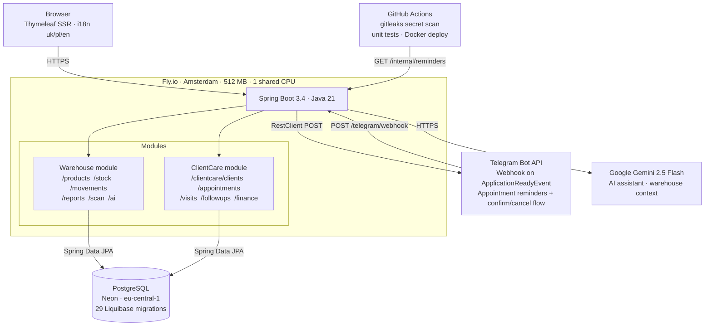

# OtchenashHair Warehouse

> **Portfolio notice:** This repository is shared for review and evaluation purposes only.
> Viewing and reading the source code is welcome; forking, copying, or redeploying it
> is not authorised. See [LICENSE](LICENSE) for details.

A production Spring Boot application built and operated solo for **OtchenashHair**, a real trichology clinic in Wrocław, Poland (owner: Mariia Otchenash). The system runs on a $0 infrastructure budget (Fly.io free tier, Neon PostgreSQL free tier) and handles live inventory management, client care workflows, appointment scheduling, Telegram-based appointment reminders, and an AI assistant — none of it is simulated or seeded with demo data. The entire codebase was developed through an AI-augmented workflow using Claude Code, with me acting as the architect and reviewer: every design decision, every migration, and every PR was directed and approved by me before it shipped to production.

**Production:** deployed on Fly.io (live, real business traffic)

---

## Architecture

---

## Notable Engineering Decisions

**JPA Specifications for dynamic filtering**
Movement history, visit journal, and gift certificate lists use `JpaSpecificationExecutor<T>` with `Specification<T>` predicates built at request time. This avoids combinatorial JPQL explosion across optional filter parameters. Where JPQL's `:param IS NULL OR field = :param` pattern caused PostgreSQL null-type inference errors, the Specification approach with `root.fetch()` resolved the ambiguity cleanly.

**JOIN FETCH to eliminate N+1 on hot paths**
`VisitRepository.findWithClientByPeriod()` fetches visits with their clients in a single query for the finance report. Stock movement queries use custom `@Query` aggregations — `findLastPurchasePricePerProduct()` and `findLastSupplierPerProduct()` — that exclude cancelled movements via a `NOT EXISTS` correlated subquery in one round trip, rather than loading all movements and filtering in Java.

**Webhook over polling — Fly.io auto-stop constraint**
Fly.io suspends the machine when idle, making Spring's `@Scheduled` unreliable for Telegram and reminders. The Telegram bot registers its webhook on `ApplicationReadyEvent` (prod profile only). Appointment reminders are triggered by a GitHub Actions cron job calling `GET /internal/reminders` with a shared secret header — an external HTTP kick rather than an in-process timer — so reminders fire even after a cold start.

**JVM tuning for 512 MB**
Explicit flags in the Dockerfile: `-Xmx180m -Xms64m -XX:MaxMetaspaceSize=120m -XX:ReservedCodeCacheSize=64m -XX:+UseSerialGC -Xss256k`. G1GC was ruled out because its region pre-allocation pushed peak RSS above the machine limit during cold starts (diagnosed from an OOM kill in production on 2026-06-11). SerialGC with a capped Metaspace keeps the startup spike inside the budget with ~120 MB headroom.

**Custom open-redirect protection**
Every controller that accepts a `returnTo` parameter passes it through `safeRedirect(returnTo, fallback)` before emitting a redirect. The method accepts only paths matching `/[^/].*`, which blocks protocol-relative URLs (`//evil.com`), absolute URLs, and path traversal. Spring Security's default redirect handling does not cover intra-app redirects driven by user-supplied parameters, so this is a deliberate application-layer control applied consistently across all affected controllers.

**Raw `RestClient` over `telegrambots-spring-boot-starter`**
The Telegram integration uses Spring 6's `RestClient` with a pre-configured base URL, rather than a third-party Telegram library. This eliminated a transitive dependency tree that conflicted with Spring Boot 3.4's autoconfiguration, gave direct control over webhook registration timing and error handling, and kept the security model explicit: webhook authenticity is validated by checking the `X-Telegram-Bot-Api-Secret-Token` header in the controller, not delegated to library internals.

---

## Engineering Hygiene

- **Secret scanning:** `gitleaks/gitleaks-action@v2` runs on every push and pull request via `.github/workflows/gitleaks.yml`, scanning full git history (`fetch-depth: 0`). Custom rules cover Google Gemini API key format (`AIzaSy…`) and Telegram bot token format (`\d{8,10}:AA…`) on top of the default ruleset.
- **Schema as code:** `spring.jpa.hibernate.ddl-auto=none`. All 29 schema changes are Liquibase migrations in `src/main/resources/db/changelog/migrations/`, applied automatically on startup. No manual DDL has ever touched the production database.
- **Tests:** 38 unit tests (JUnit 5 / Mockito) covering `StockService`, `ReportService`, `ProductService`, and dashboard DTO logic — no database required, run in CI on every push to `develop` and every PR to `master`.
- **Workflow:** Conventional commits, `develop`→`master` PR-gated delivery. 99 merged PRs to date.

---

## How to Read This Repo

The raw `develop` branch commit log reflects the reality of AI-augmented development: fast iteration, real-time debugging, and fix-on-fix commits that were not squashed before push. This is intentional and honest — it shows the actual working cadence, not a retroactively tidied history.

**The Pull Requests tab is the intended view for evaluating feature delivery.** Each PR represents a coherent feature or fix cycle merged to `master` after review. 99 closed PRs are available here:

👉 **[All merged PRs (develop → master)](https://github.com/AndriiOtchenash/otchenashhair-warehouse/pulls?q=is%3Apr+is%3Aclosed)**

---

## Stack

| Layer | Technology |
|---|---|
| Language | Java 21 |
| Framework | Spring Boot 3.4 (MVC, Data JPA, Security, Validation) |
| Templates | Thymeleaf 3.1 + Bootstrap 5 |
| Database | PostgreSQL via Neon (managed serverless) |
| Migrations | Liquibase |
| AI | Google Gemini 2.5 Flash via REST |
| Messaging | Telegram Bot API via Spring RestClient |
| Hosting | Fly.io (Docker, 512 MB RAM) |
| CI/CD | GitHub Actions (test · deploy · secret scan) |
| Build | Maven |
